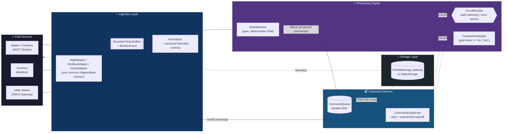
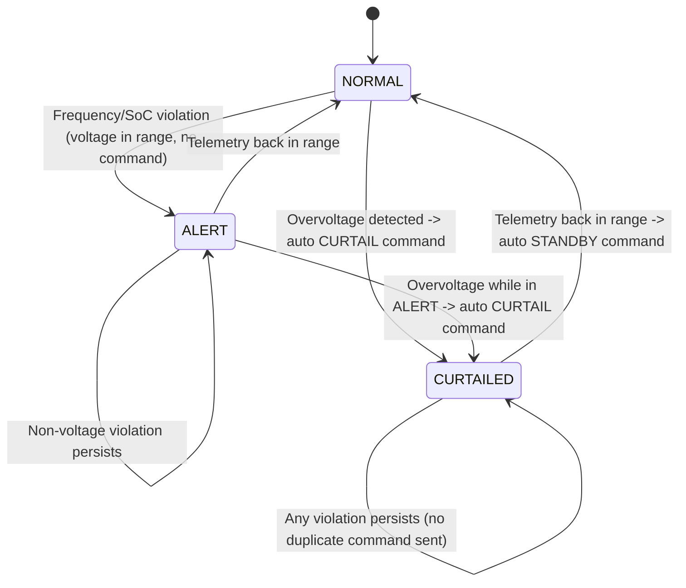
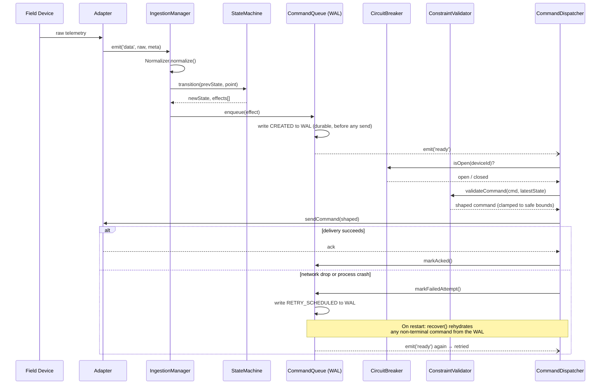

<div align="center">

# ⚡ GridSync-OS

### Distributed Energy Resource (DER) Orchestration Middleware

[](https://git.io/typing-svg)

<sub>The animated line above is rendered by an external SVG service (readme-typing-svg) — see the note at the bottom of this README if you want a zero-external-call version.</sub>

<br/>


*Normalizes fragmented DER telemetry, validates it against a deterministic grid-safety state machine, and delivers commands through a crash-safe write-ahead queue — built to run anywhere from a Termux phone to a production Linux box.*

</div>

> **License note:** `package.json` currently declares `"license": "UNLICENSED"` (all rights reserved — the default for private/proprietary Node projects). The badge above reflects that. If you decide to open-source this later, update `license` in `package.json` to `"MIT"` (or your chosen license), add a `LICENSE` file, and swap the badge to ``.

---

## Table of Contents

- [Why It's Built This Way](#why-its-built-this-way)
- [Architecture at a Glance](#architecture-at-a-glance)
- [Device State Machine](#device-state-machine)
- [Command Lifecycle & Crash Recovery](#command-lifecycle--crash-recovery)
- [REST API & Monitoring Dashboard](#rest-api--monitoring-dashboard)
- [Authentication & RBAC](#authentication--rbac)
- [Project Structure](#project-structure)
- [Getting Started (Termux)](#getting-started-termux)
- [Initializing Your Own Git Repository](#initializing-your-own-git-repository)
- [Configuration](#configuration)
- [Going to Production](#going-to-production)
- [Self-Test Suite](#self-test-suite)

---

## Why It's Built This Way

Three hard requirements shaped every design decision here:

| Requirement | Solution | Where |
|---|---|---|
| **Protocol fragmentation** — Modbus, MQTT, DNP3 all speak differently | One `AdapterBase` interface + a `Normalizer` that converts every protocol's raw payload into a single canonical schema before anything downstream sees it | `src/adapters/`, `src/ingestion/Normalizer.js` |
| **High-velocity telemetry without crashing the event loop** | Bounded, O(1) ring buffers per adapter; a batch-drain loop yields via `setImmediate()` between batches so no burst can starve timers or command dispatch | `src/ingestion/IngestionManager.js` |
| **Command signals must never be lost during network drops** | Every command is written to a durable write-ahead log (WAL) *before* any network send is attempted. A crash or dropped connection mid-dispatch just means redelivery (idempotent via `commandId`) on retry or restart | `src/commands/CommandQueue.js` |

---

## Architecture at a Glance



---

## Device State Machine

`StateMachine.transition()` is a **pure function**: `(prevState, telemetryPoint) → (newState, effects[])`, with no I/O inside it. This is the actual, verified transition graph (matches `src/engine/StateMachine.js` exactly — not an idealized version):



Because it's pure and side-effect-free, this exact graph is what the self-test suite exercises directly with fixed inputs — no mocking a transport required.

---

## Command Lifecycle & Crash Recovery

The sequence below is the "never lose a command" guarantee end-to-end, including what happens on a simulated network drop:



---

## REST API & Monitoring Dashboard

A zero-dependency HTTP API (Node's built-in `http` module, no Express/framework) plus a single-file monitoring dashboard, both served by the same process as the orchestrator -- no separate service to run.

```bash
npm start
# → Dashboard available at http://127.0.0.1:8787/
```

Open that URL in a browser for a live view of device fleet status (voltage/frequency/SoC per device, color-coded by mode), pending commands, and recent command history, auto-refreshing every 3 seconds.

### Endpoints

| Method | Path | Min. Role | Purpose |
|---|---|---|---|
| GET | `/health` | none | Liveness check |
| GET | `/` , `/dashboard` | none | Monitoring dashboard (HTML; login gate is client-side) |
| POST | `/api/auth/login` | none | `{"username","password"}` → JWT |
| POST | `/api/auth/logout` | VIEWER | Revokes the current token |
| GET | `/api/auth/me` | VIEWER | Current authenticated user's identity |
| GET | `/api/snapshot` | VIEWER | Full system snapshot (ingestion metrics, breaker status, pending count, device modes) |
| GET | `/api/devices` | VIEWER | All known devices with current mode + latest telemetry |
| GET | `/api/devices/:deviceId` | VIEWER | Detail for one device (404 if never seen) |
| GET | `/api/devices/:deviceId/telemetry?limit=N` | VIEWER | Recent telemetry history, newest first (default 50, max 500) |
| GET | `/api/commands/pending` | VIEWER | Currently live (non-terminal) commands |
| GET | `/api/commands/history?limit=N` | VIEWER | Recent command history, including who issued each one (default 50, max 500) |
| POST | `/api/commands` | OPERATOR | Issue a manual command: `{"type","deviceId","value","reason"}` |
| GET | `/api/auth/users` | ADMIN | List accounts (sanitized -- no password hashes) |
| POST | `/api/auth/users` | ADMIN | Create an account: `{"username","password","role"}` |
| POST | `/api/auth/users/:userId/disable` | ADMIN | Disable an account |
| POST | `/api/auth/tokens` | ADMIN | Issue a long-lived (5yr) named API token for automation: `{"name","role"}` |
| POST | `/api/auth/tokens/:jti/revoke` | ADMIN | Revoke a token by its `jti` |

### Security posture

This API can issue grid-control commands, so the defaults are deliberately conservative:

- **Binds to `127.0.0.1` only by default** (`GS_API_HOST`) -- not reachable from your local network unless you explicitly widen it, and even then you should put it behind a VPN or reverse proxy with auth.
- **Every `/api/*` route (except login) requires authentication.** No credential means `401`; an authenticated but under-privileged role means `403`.
- **Request bodies are size-capped** (`GS_API_MAX_BODY_BYTES`, default 64KB) so a single client can't exhaust memory with an oversized payload.

```bash
curl -X POST http://127.0.0.1:8787/api/auth/login \
  -H "Content-Type: application/json" \
  -d '{"username":"admin","password":"your-password"}'
# → {"token": "...", "expiresInSeconds": 3600, "user": {"username":"admin","role":"ADMIN"}}

curl -X POST http://127.0.0.1:8787/api/commands \
  -H "Content-Type: application/json" \
  -H "Authorization: Bearer <token>" \
  -d '{"type":"CURTAIL","deviceId":"inverter-01","value":20,"reason":"manual test"}'
```

### Design note

The dashboard is a single static HTML file (`src/api/dashboard.html`) with inline CSS/JS -- no build step, no framework, and deliberately **no external font or CDN calls**, since a grid-monitoring tool needs to keep working with zero connectivity. Its visual language is drawn from substation control panels / SCADA HMIs rather than a generic web-dashboard template: the three status colors map directly to the state machine's actual `NORMAL`/`CURTAILED`/`ALERT` modes, and each device row's status indicator only animates (a soft pulse, like a physical panel lamp) when it's in a state that needs attention -- steady means "all clear," motion means "look here." The login token is stored in `localStorage` (this is a real served page in a real browser, not a sandboxed artifact, so that's the normal and correct approach).

---

## Authentication & RBAC

Three roles, each a strict superset of the one below it:

| Role | Can do |
|---|---|
| **VIEWER** | Read-only: snapshot, device/telemetry/command history |
| **OPERATOR** | Everything VIEWER can, plus issue commands (`POST /api/commands`) |
| **ADMIN** | Everything OPERATOR can, plus create/disable accounts and issue/revoke API tokens |

**Zero new dependencies.** JWT signing/verification (HS256) and password hashing (`scrypt`) are both hand-rolled on top of Node's built-in `crypto` module -- no `jsonwebtoken`, no `bcrypt`. Accounts live in a JSON file (`data/users.json`), written through a serialized write chain (same pattern as the telemetry/command WAL) so concurrent writes can't corrupt it.

### Bootstrapping the first account

Three ways in, pick whichever fits your workflow:

```bash
# 1. Auto-created on first startup if the user store is empty:
GS_BOOTSTRAP_ADMIN_USERNAME=admin GS_BOOTSTRAP_ADMIN_PASSWORD=change-me-please npm start

# 2. CLI, bypasses the API entirely -- also useful for lockout recovery:
node scripts/create-user.js --username admin --password change-me-please --role ADMIN

# 3. Legacy shared token (see below) -- works immediately, no account needed.
```

### Legacy token (backward compatibility)

`GS_API_TOKEN` from Phase 2 still works exactly as before: any request bearing that exact token is treated as ADMIN-equivalent, no account required. This means existing automation set up before the account system keeps working unmodified. New setups should prefer real accounts (or `POST /api/auth/tokens` for automation-specific named tokens, which are individually revocable -- the shared legacy token is not).

### Sessions vs. API tokens

Both are JWTs signed with the same secret, but serve different purposes:
- **Login sessions** (`POST /api/auth/login`): short-lived (`GS_JWT_EXPIRES_IN`, default 1 hour), tied to a real account, revocable via logout.
- **API tokens** (`POST /api/auth/tokens`, ADMIN only): long-lived (5 years), named for identification, not tied to a login -- meant for scripts/automation. Individually revocable via `jti` without affecting anyone else's session.

`GS_JWT_SECRET` should be set explicitly for anything beyond local/dev use -- if unset, a random secret is generated per process start, which means **every restart invalidates all existing sessions and tokens.**


<details>
<summary><b>Click to expand full file tree</b></summary>

```
gridsync-os/
├── package.json
├── README.md
├── .gitignore
├── data/                      # runtime WAL / telemetry files (gitignored)
├── src/
│   ├── index.js                       # entrypoint: wiring + process-level safety nets
│   ├── config.js                      # all tunables (grid limits, buffer sizes, timeouts)
│   ├── utils/
│   │   ├── errors.js                  # typed domain errors
│   │   ├── logger.js                  # dependency-free structured logger
│   │   ├── validation.js              # defensive input-assertion helpers
│   │   └── RingBuffer.js              # fixed-capacity O(1) circular buffer
│   ├── adapters/
│   │   ├── AdapterBase.js             # common adapter contract (EventEmitter-based)
│   │   ├── MqttAdapter.js             # real MQTT broker transport (mqtt.js, pure JS)
│   │   ├── ModbusAdapter.js           # simulated by default -- see docblock for going live
│   │   └── Dnp3Adapter.js             # simulated by default -- see docblock for going live
│   ├── ingestion/
│   │   ├── Normalizer.js              # protocol-specific payload -> canonical schema
│   │   └── IngestionManager.js        # bounded buffers + backpressure + yielding drain loop
│   ├── engine/
│   │   ├── StateMachine.js            # pure (state, telemetry) -> (newState, commands) FSM
│   │   ├── ConstraintValidator.js     # grid-limit checks + command clamping/authorization
│   │   └── CircuitBreaker.js          # blocks commands on stale telemetry / error storms
│   ├── commands/
│   │   ├── CommandQueue.js            # durable WAL-backed command queue
│   │   └── CommandDispatcher.js       # retry logic, breaker/constraint re-checks per attempt
│   ├── storage/
│   │   ├── StorageAdapter.js          # storage interface
│   │   ├── FileWalStorage.js          # default backend: dependency-free JSONL WAL
│   │   └── SqliteStorage.js           # optional backend: node:sqlite (feature-detected)
│   ├── api/
│   │   ├── Router.js                  # minimal dependency-free HTTP router (:param support)
│   │   ├── ApiServer.js               # REST API -- zero deps, localhost-bound, JWT+RBAC guarded
│   │   └── dashboard.html             # single-file monitoring dashboard (login gate, no build step)
│   ├── auth/
│   │   ├── PasswordHasher.js          # scrypt-based hashing (Node's built-in crypto)
│   │   ├── Jwt.js                     # minimal HS256 sign/verify (Node's built-in crypto)
│   │   └── UserStore.js               # JSON-file backed accounts, 3 roles (ADMIN/OPERATOR/VIEWER)
│   └── orchestrator/
│       └── GridSyncOrchestrator.js    # composition root -- wires everything together
├── scripts/
│   ├── setup-termux.sh                # one-shot Termux environment bootstrap
│   └── create-user.js                 # CLI account bootstrap/recovery (bypasses the API)
└── test/
    └── selftest.js             # 62 tests: unit + simulated end-to-end scenarios
```

</details>

---

## Getting Started (Termux)

```bash
pkg update && pkg install nodejs git -y
git clone <your-repo-url> gridsync-os   # or unzip the delivered archive
cd gridsync-os
npm install          # pure-JS deps only, no compilation step
npm test             # run the full self-test suite (62 tests)
npm start             # boot the orchestrator (MQTT + simulated Modbus/DNP3)
```

If you don't have an MQTT broker reachable, that's fine — the MQTT adapter logs a connection failure, throttles repeated-failure logging (full detail once, then a concise summary every 10th attempt), and keeps retrying in the background without affecting the two simulated adapters (Modbus/DNP3), which run immediately. One failed subsystem never blocks the rest.

> **Running unattended on a phone?** Android's Doze/App Standby will suspend a backgrounded Termux session (you'll see all timers — heartbeat, polling, WAL compaction — freeze together, then resume). Run `pkg install termux-api && termux-wake-lock` before starting the process to prevent this, and check your OEM's battery-optimization settings (MIUI/Huawei/Samsung/OnePlus) if it still happens.

---

## Initializing Your Own Git Repository

```bash
cd gridsync-os
git init
git add -A
git commit -m "GridSync-OS: initial DER orchestration middleware core"
```

`node_modules/` and runtime data files (`data/*.jsonl`, `data/*.db`) are already excluded via `.gitignore`.

---

## Configuration

Everything tunable lives in `src/config.js` and is overridable via environment variables:

<details>
<summary><b>Click to expand full configuration reference</b></summary>

| Env var | Default | Purpose |
|---|---|---|
| `GS_MAX_BUFFER` | 10000 | Max points buffered per adapter before backpressure |
| `GS_BATCH_SIZE` | 200 | Points drained per event-loop tick |
| `GS_STALE_MS` | 15000 | Telemetry age (ms) beyond which the circuit breaker opens for a device |
| `GS_MAX_ERR_WINDOW` | 50 | Ingestion errors within `GS_ERR_WINDOW_MS` before the global breaker trips |
| `GS_CMD_MAX_ATTEMPTS` | 5 | Max dispatch retries before a command is marked FAILED |
| `GS_CMD_RETRY_BASE_MS` / `GS_CMD_RETRY_MAX_MS` | 500 / 15000 | Exponential backoff bounds for command retries |
| `GS_STORAGE_DRIVER` | `file-wal` | `file-wal` (default, zero deps) or `sqlite` (needs `node:sqlite`) |
| `GS_DATA_DIR` | `./data` | Where WAL/telemetry files live |
| `GS_MQTT_URL` | `mqtt://localhost:1883` | Broker address |
| `GS_MQTT_MAX_RECONNECT_ATTEMPTS` | 0 (unlimited) | Give up reconnecting after N failed attempts instead of retrying forever |
| `GS_API_ENABLED` | `true` | Set to `false` to disable the REST API/dashboard entirely |
| `GS_API_HOST` | `127.0.0.1` | API bind address -- deliberately localhost-only by default |
| `GS_API_PORT` | 8787 | API/dashboard port |
| `GS_API_TOKEN` | unset | Legacy shared token, always treated as ADMIN-equivalent if set (see [Authentication & RBAC](#authentication--rbac)) |
| `GS_API_MAX_BODY_BYTES` | 65536 | Max request body size for POST endpoints |
| `GS_JWT_SECRET` | random per-process | HS256 signing secret -- set explicitly so sessions survive restarts |
| `GS_JWT_EXPIRES_IN` | 3600 | Login session lifetime, seconds |
| `GS_BOOTSTRAP_ADMIN_USERNAME` / `GS_BOOTSTRAP_ADMIN_PASSWORD` | unset | If both set and the user store is empty, creates this ADMIN account on startup |

Grid safety limits (voltage/frequency/SoC bounds, max curtail/charge/discharge kW) are in `src/config.js` under `gridConstraints` — these are illustrative LV-distribution defaults (230V ±10%, 50Hz ±0.5) and **must be reviewed against your actual grid code and asset ratings before any real deployment.**

</details>

---

## Going to Production

- **Modbus / DNP3**: both adapters ship in simulated mode. `ModbusAdapter` documents the path to real TCP polling (e.g. via `jsmodbus`); `Dnp3Adapter` documents why DNP3 in production almost always sits behind a dedicated protocol gateway that republishes over MQTT, which `MqttAdapter` already handles. Both keep the exact same downstream contract, so nothing else changes.
- **TimescaleDB**: implement a `TimescaleStorage.js` against the same `StorageAdapter` interface as `FileWalStorage`/`SqliteStorage` (Postgres via `pg`, batched inserts). Swap it in via `GS_STORAGE_DRIVER`.
- **Grid constraints**: replace the illustrative values in `config.js` with your actual interconnection agreement / grid code limits.
- **REST API exposure**: if you need the dashboard/API reachable beyond localhost, put it behind a reverse proxy or VPN with its own auth layer rather than widening `GS_API_HOST` directly -- the built-in JWT+RBAC system is a floor, not a substitute for real network-level access control in production.
- **Set `GS_JWT_SECRET` explicitly.** Left unset, a random secret is generated per process start -- meaning every restart silently invalidates every session and every issued API token. Fine for local dev, not for anything you want to stay logged into.

---

## Self-Test Suite

```bash
npm test
```

62 tests covering:

- ✅ Pure-function correctness of the state machine (deterministic transitions, auto-curtailment on overvoltage, release on recovery)
- ✅ Constraint validation (clamping over-limit commands, rejecting unsafe discharge/charge based on SoC, fail-closed on unknown state)
- ✅ Circuit breaker behavior (stale telemetry, never-seen devices, global error-rate trip)
- ✅ **Crash recovery** — a command left mid-dispatch when storage is torn down (simulating a process crash) is correctly rehydrated and redelivered after a simulated restart
- ✅ **Network-drop resilience** — a command whose first delivery attempt fails is automatically retried and eventually delivered, with zero data loss
- ✅ Backpressure/overflow bounds (bounded memory under sustained overflow)
- ✅ Malformed-input resilience (bad payloads are discarded without disrupting subsequent valid points)
- ✅ A 5,000-point high-velocity burst processed without throwing or hanging
- ✅ MQTT reconnect-failure log throttling (1st failure logs full detail, every 10th logs a concise summary, counter resets on reconnect) and safe give-up after `GS_MQTT_MAX_RECONNECT_ATTEMPTS` (including a regression test for a double-`.end()` bug found and fixed during review)
- ✅ REST API routing (`Router` param extraction/matching) and full end-to-end HTTP tests against a real server on an OS-assigned port: every `/api/*` endpoint requires authentication (401 unauthenticated), malformed-JSON (400) and oversized-body (413) handling
- ✅ Password hashing and JWT sign/verify correctness (roundtrip, tampered signature/payload rejected, expired token rejected, malformed token rejected) and the user store (duplicate usernames rejected, disabled accounts blocked, password hashes never exposed via the API)
- ✅ Full RBAC enforcement end-to-end: VIEWER blocked (403) from issuing commands, OPERATOR allowed (202) with the audit trail correctly recording who issued it, only ADMIN can create accounts, logout immediately revokes a token, the legacy `GS_API_TOKEN` still works as ADMIN-equivalent, and bootstrap-admin auto-creation on first startup
- ✅ Full end-to-end: simulated overvoltage telemetry through the whole stack, confirming the resulting command stays within configured safe bounds

## Roadmap

**Built:** Authentication & RBAC (JWT sessions, scrypt-hashed accounts, 3 roles, audit trail on commands via `issuedBy`, legacy-token backward compatibility).

**Not yet built** (tracked, not silently dropped):
- Command Center UI (confirmation dialogs, live status Pending→Sent→ACK→Failed in the dashboard itself -- the API already supports this via `/api/commands`, the dashboard doesn't have the issue-a-command form yet)
- Historical database with time-range queries (last hour/day/week/month) -- current storage supports "most recent N," not date-range queries
- Live charts (voltage/frequency/power/SoC over time)
- Alarm system (over/under-voltage, high frequency, low SoC, device offline, comms timeout) as a distinct concept from the state machine's `ALERT` mode
- Structured event log (logins, commands, warnings, alarms, recoveries) as a unified queryable audit surface -- individual pieces exist (command history has `issuedBy`; auth failures are logged) but there's no single log endpoint yet
- Device management (add/remove/enable/disable/metadata/firmware tracking) -- devices are currently discovered implicitly via telemetry, not explicitly managed
- Dashboard summary cards (total generation/load, fleet health, active alarms)
- WebSocket/SSE streaming to replace dashboard polling
- Docker, CI/CD pipeline, `/metrics` endpoint

---

<div align="center">
<sub>

Built by [Syed Ali Hasan Moosavi](mailto:shalimoosavi@gmail.com) · [SAYANJALI NEXUS PRIVATE LIMITED](https://github.com/SHalimoosavi)

</sub>
</div>

---

<sub>**Note on external calls:** the badges and the animated typing header above are images fetched from shields.io and readme-typing-svg.demolab.com respectively when this README is rendered — normal for any GitHub project, but not literally zero-network. Every diagram in this document (architecture, state machine, sequence) is native GitHub-Flavored Markdown Mermaid, rendered entirely by GitHub itself with no external service. To make this README 100% dependency-free, delete the badge/typing-SVG block at the top and keep everything else as-is.</sub>
