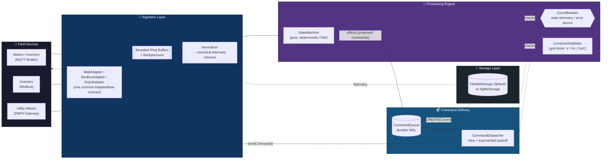
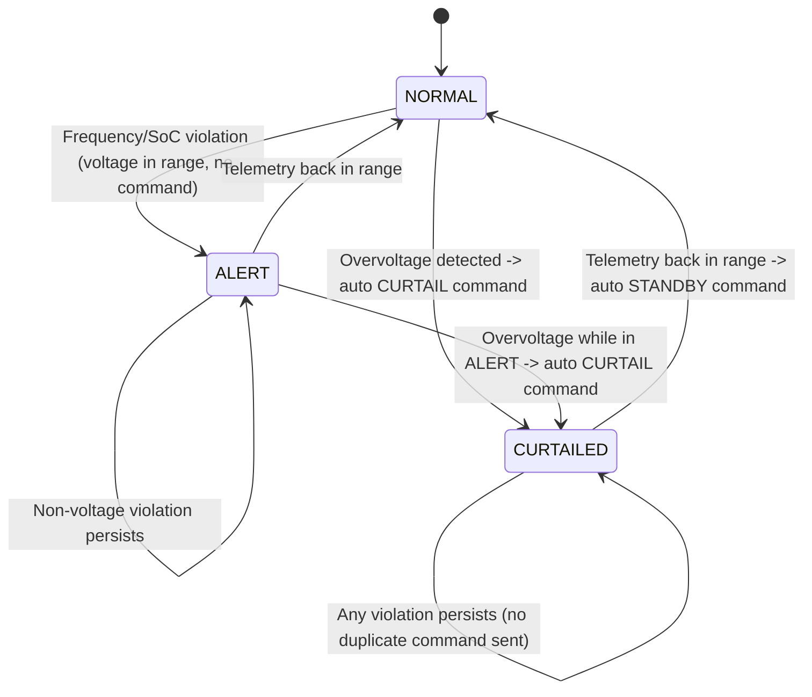
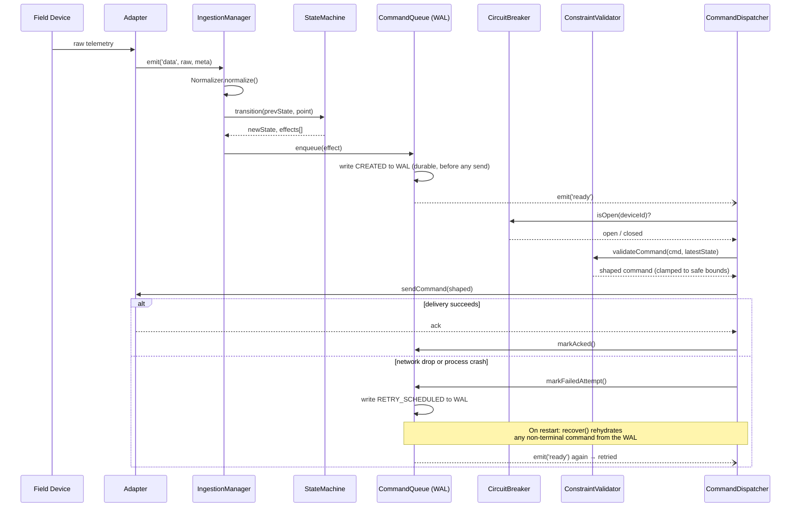
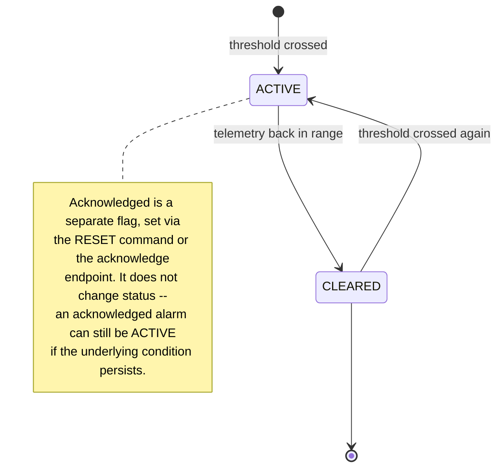

<div align="center">

# ⚡ GridSync-OS

### Distributed Energy Resource (DER) Orchestration Middleware

[](https://git.io/typing-svg)

<sub>The animated line above is rendered by an external SVG service (readme-typing-svg) — see the note at the bottom of this README if you want a zero-external-call version.</sub>

<br/>


*Normalizes fragmented DER telemetry, validates it against a deterministic grid-safety state machine, and delivers commands through a crash-safe write-ahead queue — built to run anywhere from a Termux phone to a production Linux box.*

</div>

> **License note:** `package.json` currently declares `"license": "UNLICENSED"` (all rights reserved — the default for private/proprietary Node projects). The badge above reflects that. If you decide to open-source this later, update `license` in `package.json` to `"MIT"` (or your chosen license), add a `LICENSE` file, and swap the badge to ``.

---

## Table of Contents

- [Why It's Built This Way](#why-its-built-this-way)
- [Architecture at a Glance](#architecture-at-a-glance)
- [Device State Machine](#device-state-machine)
- [Command Lifecycle & Crash Recovery](#command-lifecycle--crash-recovery)
- [REST API & Monitoring Dashboard](#rest-api--monitoring-dashboard)
- [Authentication & RBAC](#authentication--rbac)
- [Operations Console (v0.4.0)](#operations-console-v040)
- [Device Management (v0.5.0)](#device-management-v050)
- [Historical Reporting & Time-Range Queries (v0.6.0)](#historical-reporting--time-range-queries-v060)
- [Project Structure](#project-structure)
- [Getting Started (Termux)](#getting-started-termux)
- [Initializing Your Own Git Repository](#initializing-your-own-git-repository)
- [Configuration](#configuration)
- [Going to Production](#going-to-production)
- [Self-Test Suite](#self-test-suite)

---

## Why It's Built This Way

Three hard requirements shaped every design decision here:

| Requirement | Solution | Where |
|---|---|---|
| **Protocol fragmentation** — Modbus, MQTT, DNP3 all speak differently | One `AdapterBase` interface + a `Normalizer` that converts every protocol's raw payload into a single canonical schema before anything downstream sees it | `src/adapters/`, `src/ingestion/Normalizer.js` |
| **High-velocity telemetry without crashing the event loop** | Bounded, O(1) ring buffers per adapter; a batch-drain loop yields via `setImmediate()` between batches so no burst can starve timers or command dispatch | `src/ingestion/IngestionManager.js` |
| **Command signals must never be lost during network drops** | Every command is written to a durable write-ahead log (WAL) *before* any network send is attempted. A crash or dropped connection mid-dispatch just means redelivery (idempotent via `commandId`) on retry or restart | `src/commands/CommandQueue.js` |

---

## Architecture at a Glance



---

## Device State Machine

`StateMachine.transition()` is a **pure function**: `(prevState, telemetryPoint) → (newState, effects[])`, with no I/O inside it. This is the actual, verified transition graph (matches `src/engine/StateMachine.js` exactly — not an idealized version):



Because it's pure and side-effect-free, this exact graph is what the self-test suite exercises directly with fixed inputs — no mocking a transport required.

---

## Command Lifecycle & Crash Recovery

The sequence below is the "never lose a command" guarantee end-to-end, including what happens on a simulated network drop:



---

## REST API & Monitoring Dashboard

A zero-dependency HTTP API (Node's built-in `http` module, no Express/framework) plus a single-file monitoring dashboard, both served by the same process as the orchestrator -- no separate service to run.

```bash
npm start
# → Dashboard available at http://127.0.0.1:8787/
```

Open that URL in a browser for a live view of device fleet status (voltage/frequency/SoC per device, color-coded by mode), pending commands, and recent command history, auto-refreshing every 3 seconds.

### Endpoints

| Method | Path | Min. Role | Purpose |
|---|---|---|---|
| GET | `/health` | none | Liveness check |
| GET | `/` , `/dashboard` | none | Monitoring dashboard (HTML; login gate is client-side) |
| POST | `/api/auth/login` | none | `{"username","password"}` → JWT |
| POST | `/api/auth/logout` | VIEWER | Revokes the current token |
| GET | `/api/auth/me` | VIEWER | Current authenticated user's identity |
| GET | `/api/snapshot` | VIEWER | Full system snapshot (ingestion metrics, breaker status, pending count, device modes) |
| GET | `/api/devices` | VIEWER | All known devices with current mode + latest telemetry + registry metadata |
| GET | `/api/devices/registry?includeRemoved=true` | VIEWER | Full registry, including devices pre-provisioned but never yet connected |
| POST | `/api/devices` | ADMIN | Register/pre-provision a device: `{"deviceId","name","location","notes","firmwareVersion"}` |
| GET | `/api/devices/:deviceId` | VIEWER | Detail for one device (404 if never seen) |
| PATCH | `/api/devices/:deviceId` | ADMIN | Update device metadata |
| DELETE | `/api/devices/:deviceId` | ADMIN | Remove (soft-delete) a device |
| POST | `/api/devices/:deviceId/enable` | ADMIN | Enable a device (also restores a removed one) |
| POST | `/api/devices/:deviceId/disable` | ADMIN | Disable a device -- blocks commands, not telemetry/alarms |
| GET | `/api/devices/:deviceId/telemetry?limit=N&range=X` | VIEWER | Recent telemetry history, newest first (default 50, max 500); `range` = `hour`\\|`day`\\|`week`\\|`month`, or explicit `startTime`/`endTime` (ms epoch) |
| GET | `/api/commands/pending` | VIEWER | Currently live (non-terminal) commands |
| GET | `/api/commands/history?limit=N&deviceId=X&status=Y&range=Z` | VIEWER | Recent command history, including who issued each one (default 50, max 500); same `range`/`startTime`/`endTime` support as telemetry |
| POST | `/api/commands` | OPERATOR | Issue a manual command: `{"type","deviceId","value","reason"}` (types: `CURTAIL`,`DISCHARGE`,`CHARGE`,`STANDBY`,`RESET`) |
| GET | `/api/alarms/active` | VIEWER | Currently active (unresolved) alarms fleet-wide |
| GET | `/api/alarms/history?limit=N&deviceId=X&status=Y&range=Z` | VIEWER | Recent alarm history (triggered/cleared/acknowledged); same `range`/`startTime`/`endTime` support |
| POST | `/api/alarms/:alarmId/acknowledge` | OPERATOR | Acknowledge one active alarm |
| GET | `/api/auth/users` | ADMIN | List accounts (sanitized -- no password hashes) |
| POST | `/api/auth/users` | ADMIN | Create an account: `{"username","password","role"}` |
| POST | `/api/auth/users/:userId/disable` | ADMIN | Disable an account |
| POST | `/api/auth/tokens` | ADMIN | Issue a long-lived (5yr) named API token for automation: `{"name","role"}` |
| POST | `/api/auth/tokens/:jti/revoke` | ADMIN | Revoke a token by its `jti` |

### Security posture

This API can issue grid-control commands, so the defaults are deliberately conservative:

- **Binds to `127.0.0.1` only by default** (`GS_API_HOST`) -- not reachable from your local network unless you explicitly widen it, and even then you should put it behind a VPN or reverse proxy with auth.
- **Every `/api/*` route (except login) requires authentication.** No credential means `401`; an authenticated but under-privileged role means `403`.
- **Request bodies are size-capped** (`GS_API_MAX_BODY_BYTES`, default 64KB) so a single client can't exhaust memory with an oversized payload.

```bash
curl -X POST http://127.0.0.1:8787/api/auth/login \
  -H "Content-Type: application/json" \
  -d '{"username":"admin","password":"your-password"}'
# → {"token": "...", "expiresInSeconds": 3600, "user": {"username":"admin","role":"ADMIN"}}

curl -X POST http://127.0.0.1:8787/api/commands \
  -H "Content-Type: application/json" \
  -H "Authorization: Bearer <token>" \
  -d '{"type":"CURTAIL","deviceId":"inverter-01","value":20,"reason":"manual test"}'
```

### Design note

The dashboard is a single static HTML file (`src/api/dashboard.html`) with inline CSS/JS -- no build step, no framework, and deliberately **no external font or CDN calls**, since a grid-monitoring tool needs to keep working with zero connectivity. Its visual language is drawn from substation control panels / SCADA HMIs rather than a generic web-dashboard template: the three status colors map directly to the state machine's actual `NORMAL`/`CURTAILED`/`ALERT` modes, and each device row's status indicator only animates (a soft pulse, like a physical panel lamp) when it's in a state that needs attention -- steady means "all clear," motion means "look here." The login token is stored in `localStorage` (this is a real served page in a real browser, not a sandboxed artifact, so that's the normal and correct approach).

---

## Authentication & RBAC

Three roles, each a strict superset of the one below it:

| Role | Can do |
|---|---|
| **VIEWER** | Read-only: snapshot, device/telemetry/command history |
| **OPERATOR** | Everything VIEWER can, plus issue commands (`POST /api/commands`) |
| **ADMIN** | Everything OPERATOR can, plus create/disable accounts and issue/revoke API tokens |

**Zero new dependencies.** JWT signing/verification (HS256) and password hashing (`scrypt`) are both hand-rolled on top of Node's built-in `crypto` module -- no `jsonwebtoken`, no `bcrypt`. Accounts live in a JSON file (`data/users.json`), written through a serialized write chain (same pattern as the telemetry/command WAL) so concurrent writes can't corrupt it.

### Bootstrapping the first account

Three ways in, pick whichever fits your workflow:

```bash
# 1. Auto-created on first startup if the user store is empty:
GS_BOOTSTRAP_ADMIN_USERNAME=admin GS_BOOTSTRAP_ADMIN_PASSWORD=change-me-please npm start

# 2. CLI, bypasses the API entirely -- also useful for lockout recovery:
node scripts/create-user.js --username admin --password change-me-please --role ADMIN

# 3. Legacy shared token (see below) -- works immediately, no account needed.
```

### Legacy token (backward compatibility)

`GS_API_TOKEN` from Phase 2 still works exactly as before: any request bearing that exact token is treated as ADMIN-equivalent, no account required. This means existing automation set up before the account system keeps working unmodified. New setups should prefer real accounts (or `POST /api/auth/tokens` for automation-specific named tokens, which are individually revocable -- the shared legacy token is not).

### Sessions vs. API tokens

Both are JWTs signed with the same secret, but serve different purposes:
- **Login sessions** (`POST /api/auth/login`): short-lived (`GS_JWT_EXPIRES_IN`, default 1 hour), tied to a real account, revocable via logout.
- **API tokens** (`POST /api/auth/tokens`, ADMIN only): long-lived (5 years), named for identification, not tied to a login -- meant for scripts/automation. Individually revocable via `jti` without affecting anyone else's session.

`GS_JWT_SECRET` should be set explicitly for anything beyond local/dev use -- if unset, a random secret is generated per process start, which means **every restart invalidates all existing sessions and tokens.**

---

## Operations Console (v0.4.0)

Four capabilities operators actually use day-to-day, all built on the authentication foundation: **Command Center**, **Alarm Engine**, **Command History filtering**, and **Live Telemetry Charts**.

### Command Center

The dashboard's "Live Telemetry & Device Control" section lets an OPERATOR or ADMIN select a device and issue a command (`CURTAIL`, `DISCHARGE`, `CHARGE`, `STANDBY`, `RESET`) directly -- with a confirmation dialog before anything is sent, and the same durability/constraint/circuit-breaker guarantees as auto-generated commands (see [Command Lifecycle & Crash Recovery](#command-lifecycle--crash-recovery)). VIEWER accounts see a read-only notice instead of the form -- the UI hides it, and the API independently enforces it (`403` on `POST /api/commands` below OPERATOR), so hiding the button is a UX nicety, not the actual security boundary.

`RESET` is new in v0.4.0: it's a real command sent to the device (adapters `ack` it like any other), *and* it acknowledges every currently-active alarm for that device. It does not force-clear alarms whose underlying condition hasn't actually resolved -- see the lifecycle below.

### Alarm Engine

Six alarm types, evaluated independently from the state machine's control-loop decisions (same `gridConstraints` thresholds, but the state machine decides *actions*, the alarm engine decides *notifications* -- deliberately separate concerns):

| Type | Severity | Trigger |
|---|---|---|
| `OVER_VOLTAGE` | CRITICAL | voltage exceeds `gridConstraints.voltage.max` |
| `UNDER_VOLTAGE` | CRITICAL | voltage below `gridConstraints.voltage.min` |
| `HIGH_FREQUENCY` | WARNING | frequency exceeds `gridConstraints.frequency.max` |
| `LOW_SOC` | WARNING | state of charge below `gridConstraints.soc.min` |
| `COMM_TIMEOUT` | WARNING | no telemetry for `GS_COMM_TIMEOUT_MS` (default 7.5s) -- an early, softer signal |
| `DEVICE_OFFLINE` | CRITICAL | no telemetry for `GS_STALE_MS` (same threshold the circuit breaker uses) -- the device is now untrusted for commands too |

Every trigger/clear/acknowledge event is persisted to a durable WAL (mirroring the command queue's proven pattern), so alarm history survives a restart.



Endpoints: `GET /api/alarms/active`, `GET /api/alarms/history?limit=N&deviceId=X&status=Y`, `POST /api/alarms/:alarmId/acknowledge` (OPERATOR+). The dashboard's "Active Alarms" panel polls the first and lets OPERATOR+ users acknowledge directly.

### Command History filtering

`GET /api/commands/history` (and the equivalent `/api/alarms/history`) now accept `?deviceId=X` and `?status=Y` query filters, so "show me everything that happened to inverter-01" or "show me every FAILED command fleet-wide" is a single request rather than client-side filtering of the full history.

### Live Telemetry Charts

Voltage, Frequency, Power, and State-of-Charge, rendered as small SVG line charts for whichever device is selected in the shared device dropdown (the same selector that targets the Command Center). **Hand-rolled, not a charting library** -- consistent with the rest of the dashboard's zero-external-dependency approach; there's no Chart.js/D3 script tag to fail loading on a flaky connection. A device that doesn't report a given metric (e.g. a `METER` with no `soc`) shows "No data" for that chart rather than a broken/empty plot.

---

## Device Management (v0.5.0)

Devices are still **auto-discovered via telemetry** exactly as before -- nothing about that changes. What's new is an explicit registry layered on top: metadata (name, location, firmware version, notes), a lifecycle (`ENABLED`/`DISABLED`/`REMOVED`), and the ability to pre-provision a device before it's ever connected.

**Performance note, since this sits on the ingestion hot path:** the registry keeps an in-memory `Map` as the read source of truth (write-through to disk), so every telemetry point's registry check is a synchronous lookup, not a disk read -- consistent with the "thousands of points per second without crashing the event loop" goal from day one.

- **Add / pre-provision**: `POST /api/devices` registers a device before it's ever sent telemetry -- useful for planning a fleet before hardware is deployed.
- **Enable / Disable**: a disabled device is blocked from receiving *commands* -- both operator-issued and auto-generated ones (e.g. the state machine's auto-curtailment), since both flow through the same `CommandDispatcher`. Telemetry keeps recording and alarms are **not** suppressed -- a disabled-but-still-connected device going out of range arguably deserves more attention, not less, so that's deliberately left alone rather than silently hidden.
- **Remove**: a *soft*-delete (status `REMOVED`), not a file deletion -- hard-deleting the record would make a removed device indistinguishable from one simply never seen before, and its very next telemetry point would silently re-register it. `REMOVED` devices' future telemetry is dropped; the record (and its history) stays visible via `?includeRemoved=true` for audit purposes, and `POST .../enable` brings it back.
- **Metadata editing & firmware tracking**: `PATCH /api/devices/:deviceId` for name/location/notes/firmware version. Firmware version is operator-entered, not auto-discovered -- none of the current adapters (simulated or real MQTT) transmit one, so this isn't a claim of automatic detection.

New endpoints (all ADMIN except the registry read, which is VIEWER+):

| Method | Path | Purpose |
|---|---|---|
| GET | `/api/devices/registry?includeRemoved=true` | Full registry, including pre-provisioned devices that haven't connected yet |
| POST | `/api/devices` | Register: `{"deviceId","name","location","notes","firmwareVersion"}` |
| PATCH | `/api/devices/:deviceId` | Update metadata |
| POST | `/api/devices/:deviceId/enable` | Enable (also restores a removed device) |
| POST | `/api/devices/:deviceId/disable` | Disable -- blocks commands, not telemetry/alarms |
| DELETE | `/api/devices/:deviceId` | Remove (soft-delete) |

The dashboard's "Device Registry" panel (ADMIN-only for actions, visible to everyone) lists every registered device with inline Enable/Disable/Remove/Edit buttons and a registration form.

### Bugs found and fixed while building this

**Retry backoff was never actually backing off.** Testing the disable/re-enable flow surfaced a real, pre-existing bug in the command retry mechanism (not new to this feature -- it's been there since the retry logic was first written): a retrying command was pushed back onto the dispatch queue **immediately** inside `markFailedAttempt`, before its exponential backoff delay had actually elapsed. Since the dispatcher's processing loop was usually still active at that point, it would pick the command straight back up in the same tight loop -- completely bypassing the intended backoff and exhausting the entire retry budget in milliseconds instead of over the intended seconds. It never surfaced before because no existing test depended on backoff *timing* being real, only on the eventual outcome. Fixed by making re-queueing wait for the backoff timer to actually fire (`CommandQueue.requeueForRetry`), and verified with a direct timing measurement: attempts now land at ~2ms/104ms/305ms/707ms/1108ms against an expected ~0/100/300/700/1100ms schedule.

**Shutdown could lose a pending write.** `DeviceRegistry` and `UserStore` each keep their own independent write-serialization chain (writing to `devices.json`/`users.json`), separate from `FileWalStorage`'s. Neither had a way to be flushed, and `orchestrator.stop()` never waited for them -- so a disable/enable/register/user-creation call issued right before shutdown could still be mid-write when the process exited, silently losing that change. This is a real production concern, not just a test artifact (it surfaced as an intermittent `ENOTEMPTY` during test cleanup, which is what led to finding it). Fixed by adding `close()` to both, awaited alongside `storage.close()` in `orchestrator.stop()`.

---

## Historical Reporting & Time-Range Queries (v0.6.0)

**Scoping note, stated up front:** this is real `startTime`/`endTime` filtering with `hour`/`day`/`week`/`month` presets added to the *existing* storage backends -- not a new database technology. This project has stayed zero-external-dependency (no Postgres, no native builds, Termux-first) through every phase so far, and adding a hard requirement on an external database server for one reporting feature would break that. If you need serious historical scale (years of high-frequency data, calendar-aware rollups, fast aggregation), that's genuinely what a proper time-series database solves -- the `TimescaleStorage.js` extension point mentioned in [Going to Production](#going-to-production) is exactly where that would go, and it's still not built.

### What's actually here

Every history-capable endpoint now accepts:

- `?range=hour` / `day` / `week` / `month` -- a rolling window ending now (`month` is a fixed 30-day window, not calendar-aware)
- `?startTime=<ms>&endTime=<ms>` -- explicit epoch-millisecond bounds, either or both; these override the equivalent field from `range` if both are given, so `?range=day&endTime=1700000000000` ("a day ending at a specific point") works too
- The resolved `{startTime, endTime}` is echoed back in the response body, so a client always knows exactly what window it got without recomputing it

```
GET /api/devices/:deviceId/telemetry?range=week
GET /api/commands/history?range=day&deviceId=inverter-01
GET /api/alarms/history?startTime=1700000000000&endTime=1700086400000
```

The dashboard's "Live Telemetry & Device Control" panel has a Time Range selector next to the device selector, driving both the charts and the Recent Commands table together. Chart point density scales with the selected window (30 points for "hour," up to the API's 500-point cap for "week"/"month") so a wide window isn't under-sampled into a nearly-flat line.

### The honest performance tradeoff between backends

- **`SqliteStorage`**: `startTime`/`endTime` become indexed `WHERE ts BETWEEN ? AND ?` clauses -- efficient regardless of how much history has accumulated.
- **`FileWalStorage`** (the default): still a linear scan over the relevant `.jsonl` file, now with an additional filter predicate. Correct, and fine for a Termux-scale deployment, but a `?range=month` query on a fleet that's been running for months does mean reading that whole file. If query latency at that scale matters for your deployment, that's the concrete signal to switch to `GS_STORAGE_DRIVER=sqlite`.

---

## Project Structure

<details>
<summary><b>Click to expand full file tree</b></summary>

```
gridsync-os/
├── package.json
├── README.md
├── .gitignore
├── data/                      # runtime WAL / telemetry files (gitignored)
├── src/
│   ├── index.js                       # entrypoint: wiring + process-level safety nets
│   ├── config.js                      # all tunables (grid limits, buffer sizes, timeouts)
│   ├── utils/
│   │   ├── errors.js                  # typed domain errors
│   │   ├── logger.js                  # dependency-free structured logger
│   │   ├── validation.js              # defensive input-assertion helpers
│   │   ├── RingBuffer.js              # fixed-capacity O(1) circular buffer
│   │   └── timeRange.js               # hour/day/week/month presets + explicit startTime/endTime resolution
│   ├── adapters/
│   │   ├── AdapterBase.js             # common adapter contract (EventEmitter-based)
│   │   ├── MqttAdapter.js             # real MQTT broker transport (mqtt.js, pure JS)
│   │   ├── ModbusAdapter.js           # simulated by default -- see docblock for going live
│   │   └── Dnp3Adapter.js             # simulated by default -- see docblock for going live
│   ├── ingestion/
│   │   ├── Normalizer.js              # protocol-specific payload -> canonical schema
│   │   └── IngestionManager.js        # bounded buffers + backpressure + yielding drain loop
│   ├── engine/
│   │   ├── StateMachine.js            # pure (state, telemetry) -> (newState, commands) FSM
│   │   ├── ConstraintValidator.js     # grid-limit checks + command clamping/authorization
│   │   ├── CircuitBreaker.js          # blocks commands on stale telemetry / error storms
│   │   └── AlarmEngine.js             # 6 alarm types, trigger/clear/acknowledge lifecycle
│   ├── commands/
│   │   ├── CommandQueue.js            # durable WAL-backed command queue
│   │   └── CommandDispatcher.js       # retry logic, breaker/constraint re-checks per attempt
│   ├── storage/
│   │   ├── StorageAdapter.js          # storage interface
│   │   ├── FileWalStorage.js          # default backend: dependency-free JSONL WAL
│   │   └── SqliteStorage.js           # optional backend: node:sqlite (feature-detected)
│   ├── api/
│   │   ├── Router.js                  # minimal dependency-free HTTP router (:param support)
│   │   ├── ApiServer.js               # REST API -- zero deps, localhost-bound, JWT+RBAC guarded
│   │   └── dashboard.html             # single-file monitoring dashboard (login gate, no build step)
│   ├── auth/
│   │   ├── PasswordHasher.js          # scrypt-based hashing (Node's built-in crypto)
│   │   ├── Jwt.js                     # minimal HS256 sign/verify (Node's built-in crypto)
│   │   └── UserStore.js               # JSON-file backed accounts, 3 roles (ADMIN/OPERATOR/VIEWER)
│   ├── devices/
│   │   └── DeviceRegistry.js          # metadata/lifecycle overlay, in-memory-cache (hot-path safe)
│   └── orchestrator/
│       └── GridSyncOrchestrator.js    # composition root -- wires everything together
├── scripts/
│   ├── setup-termux.sh                # one-shot Termux environment bootstrap
│   └── create-user.js                 # CLI account bootstrap/recovery (bypasses the API)
└── test/
    └── selftest.js             # 101 tests: unit + simulated end-to-end scenarios
```

</details>

---

## Getting Started (Termux)

```bash
pkg update && pkg install nodejs git -y
git clone <your-repo-url> gridsync-os   # or unzip the delivered archive
cd gridsync-os
npm install          # pure-JS deps only, no compilation step
npm test             # run the full self-test suite (101 tests)
npm start             # boot the orchestrator (MQTT + simulated Modbus/DNP3)
```

If you don't have an MQTT broker reachable, that's fine — the MQTT adapter logs a connection failure, throttles repeated-failure logging (full detail once, then a concise summary every 10th attempt), and keeps retrying in the background without affecting the two simulated adapters (Modbus/DNP3), which run immediately. One failed subsystem never blocks the rest.

> **Running unattended on a phone?** Android's Doze/App Standby will suspend a backgrounded Termux session (you'll see all timers — heartbeat, polling, WAL compaction — freeze together, then resume). Run `pkg install termux-api && termux-wake-lock` before starting the process to prevent this, and check your OEM's battery-optimization settings (MIUI/Huawei/Samsung/OnePlus) if it still happens.

---

## Initializing Your Own Git Repository

```bash
cd gridsync-os
git init
git add -A
git commit -m "GridSync-OS: initial DER orchestration middleware core"
```

`node_modules/` and runtime data files (`data/*.jsonl`, `data/*.db`) are already excluded via `.gitignore`.

---

## Configuration

Everything tunable lives in `src/config.js` and is overridable via environment variables:

<details>
<summary><b>Click to expand full configuration reference</b></summary>

| Env var | Default | Purpose |
|---|---|---|
| `GS_MAX_BUFFER` | 10000 | Max points buffered per adapter before backpressure |
| `GS_BATCH_SIZE` | 200 | Points drained per event-loop tick |
| `GS_STALE_MS` | 15000 | Telemetry age (ms) beyond which the circuit breaker opens for a device |
| `GS_MAX_ERR_WINDOW` | 50 | Ingestion errors within `GS_ERR_WINDOW_MS` before the global breaker trips |
| `GS_CMD_MAX_ATTEMPTS` | 5 | Max dispatch retries before a command is marked FAILED |
| `GS_CMD_RETRY_BASE_MS` / `GS_CMD_RETRY_MAX_MS` | 500 / 15000 | Exponential backoff bounds for command retries |
| `GS_STORAGE_DRIVER` | `file-wal` | `file-wal` (default, zero deps) or `sqlite` (needs `node:sqlite`) |
| `GS_DATA_DIR` | `./data` | Where WAL/telemetry files live |
| `GS_MQTT_URL` | `mqtt://localhost:1883` | Broker address |
| `GS_MQTT_MAX_RECONNECT_ATTEMPTS` | 0 (unlimited) | Give up reconnecting after N failed attempts instead of retrying forever |
| `GS_API_ENABLED` | `true` | Set to `false` to disable the REST API/dashboard entirely |
| `GS_API_HOST` | `127.0.0.1` | API bind address -- deliberately localhost-only by default |
| `GS_API_PORT` | 8787 | API/dashboard port |
| `GS_API_TOKEN` | unset | Legacy shared token, always treated as ADMIN-equivalent if set (see [Authentication & RBAC](#authentication--rbac)) |
| `GS_API_MAX_BODY_BYTES` | 65536 | Max request body size for POST endpoints |
| `GS_JWT_SECRET` | random per-process | HS256 signing secret -- set explicitly so sessions survive restarts |
| `GS_JWT_EXPIRES_IN` | 3600 | Login session lifetime, seconds |
| `GS_BOOTSTRAP_ADMIN_USERNAME` / `GS_BOOTSTRAP_ADMIN_PASSWORD` | unset | If both set and the user store is empty, creates this ADMIN account on startup |
| `GS_COMM_TIMEOUT_MS` | 7500 | Softer/earlier `COMM_TIMEOUT` alarm threshold (fires before `DEVICE_OFFLINE`) |
| `GS_ALARM_CHECK_INTERVAL_MS` | 5000 | How often all known devices are swept for staleness (`COMM_TIMEOUT`/`DEVICE_OFFLINE` can only be detected by absence of telemetry, not a triggering event) |

Grid safety limits (voltage/frequency/SoC bounds, max curtail/charge/discharge kW) are in `src/config.js` under `gridConstraints` — these are illustrative LV-distribution defaults (230V ±10%, 50Hz ±0.5) and **must be reviewed against your actual grid code and asset ratings before any real deployment.**

</details>

---

## Going to Production

- **Modbus / DNP3**: both adapters ship in simulated mode. `ModbusAdapter` documents the path to real TCP polling (e.g. via `jsmodbus`); `Dnp3Adapter` documents why DNP3 in production almost always sits behind a dedicated protocol gateway that republishes over MQTT, which `MqttAdapter` already handles. Both keep the exact same downstream contract, so nothing else changes.
- **TimescaleDB**: implement a `TimescaleStorage.js` against the same `StorageAdapter` interface as `FileWalStorage`/`SqliteStorage` (Postgres via `pg`, batched inserts). Swap it in via `GS_STORAGE_DRIVER`.
- **Grid constraints**: replace the illustrative values in `config.js` with your actual interconnection agreement / grid code limits.
- **REST API exposure**: if you need the dashboard/API reachable beyond localhost, put it behind a reverse proxy or VPN with its own auth layer rather than widening `GS_API_HOST` directly -- the built-in JWT+RBAC system is a floor, not a substitute for real network-level access control in production.
- **Set `GS_JWT_SECRET` explicitly.** Left unset, a random secret is generated per process start -- meaning every restart silently invalidates every session and every issued API token. Fine for local dev, not for anything you want to stay logged into.

---

## Self-Test Suite

```bash
npm test
```

101 tests covering:

- ✅ Pure-function correctness of the state machine (deterministic transitions, auto-curtailment on overvoltage, release on recovery)
- ✅ Constraint validation (clamping over-limit commands, rejecting unsafe discharge/charge based on SoC, fail-closed on unknown state)
- ✅ Circuit breaker behavior (stale telemetry, never-seen devices, global error-rate trip)
- ✅ **Crash recovery** — a command left mid-dispatch when storage is torn down (simulating a process crash) is correctly rehydrated and redelivered after a simulated restart
- ✅ **Network-drop resilience** — a command whose first delivery attempt fails is automatically retried and eventually delivered, with zero data loss
- ✅ Backpressure/overflow bounds (bounded memory under sustained overflow)
- ✅ Malformed-input resilience (bad payloads are discarded without disrupting subsequent valid points)
- ✅ A 5,000-point high-velocity burst processed without throwing or hanging
- ✅ Device registry: idempotent auto-registration, duplicate-registration rejection, soft-delete semantics (removed devices blocked, excluded by default, restorable), persistence across a simulated restart, and the in-memory-cache read path staying correct under all of the above
- ✅ Device lifecycle enforcement end-to-end: a DISABLED device blocks both manual *and* auto-generated (state-machine) commands, a REMOVED device's telemetry is dropped without being processed, `/api/devices/registry` isn't shadowed by the `/:deviceId` route, and full ADMIN-gated CRUD (register/update/enable/disable/remove) with 404s for unknown devices
- ✅ **Retry backoff timing**, verified with actual elapsed-time measurements (not just eventual outcome) — a real, previously-undetected bug where retries bypassed their exponential backoff entirely is fixed and regression-tested
- ✅ **Clean shutdown durability** — `DeviceRegistry` and `UserStore` writes are now flushed before `orchestrator.stop()` resolves; found via an intermittent test-cleanup race that traced back to a real gap where a pending disable/enable/register write could be lost on shutdown
- ✅ Time-range queries: all four named presets resolve to the correct window, explicit `startTime`/`endTime` correctly override a named range per-field, invalid/unrecognized values are ignored rather than erroring, and both storage backends (`FileWalStorage` linear-scan, `SqliteStorage` indexed `WHERE`) return identical, correctly-bounded results combined with existing `deviceId`/`status` filters
- ✅ MQTT reconnect-failure log throttling (1st failure logs full detail, every 10th logs a concise summary, counter resets on reconnect) and safe give-up after `GS_MQTT_MAX_RECONNECT_ATTEMPTS` (including a regression test for a double-`.end()` bug found and fixed during review)
- ✅ REST API routing (`Router` param extraction/matching) and full end-to-end HTTP tests against a real server on an OS-assigned port: every `/api/*` endpoint requires authentication (401 unauthenticated), malformed-JSON (400) and oversized-body (413) handling
- ✅ Password hashing and JWT sign/verify correctness (roundtrip, tampered signature/payload rejected, expired token rejected, malformed token rejected) and the user store (duplicate usernames rejected, disabled accounts blocked, password hashes never exposed via the API)
- ✅ Full RBAC enforcement end-to-end: VIEWER blocked (403) from issuing commands, OPERATOR allowed (202) with the audit trail correctly recording who issued it, only ADMIN can create accounts, logout immediately revokes a token, the legacy `GS_API_TOKEN` still works as ADMIN-equivalent, and bootstrap-admin auto-creation on first startup
- ✅ Alarm engine: all 6 alarm types trigger/clear correctly, no duplicate alarms while a condition persists, `COMM_TIMEOUT` fires before `DEVICE_OFFLINE` (softer threshold first), acknowledge/acknowledgeAllForDevice scoping, and full persistence (`SqliteStorage`'s alarm + filtered-query support -- previously entirely untested -- now has dedicated coverage alongside `FileWalStorage`)
- ✅ `RESET` command end-to-end: dispatches to the adapter *and* acknowledges (not force-clears) active alarms for that device; command/alarm history `deviceId`/`status` query filters
- ✅ Full end-to-end: simulated overvoltage telemetry through the whole stack, confirming the resulting command stays within configured safe bounds

## Roadmap

**Built:**
- **Authentication & RBAC**: JWT sessions, scrypt-hashed accounts, 3 roles, audit trail on commands via `issuedBy`, legacy-token backward compatibility.
- **v0.4.0 Operations Console**: Command Center (dashboard form + confirmation dialog + RBAC-aware visibility, `RESET` command type), Alarm Engine (6 types, persisted trigger/clear/acknowledge lifecycle), Command/Alarm History filtering (`deviceId`/`status` query params), Live Telemetry Charts (hand-rolled SVG, no charting library).
- **v0.5.0 Device Management**: explicit registry (add/pre-provision, enable/disable, soft-delete/remove, metadata + firmware tracking) layered on top of telemetry-driven discovery, ADMIN-gated CRUD, hot-path-safe in-memory-cache design.
- **v0.6.0 Historical Reporting**: `hour`/`day`/`week`/`month` presets plus explicit `startTime`/`endTime` on all three history endpoints (telemetry, commands, alarms), both storage backends.

**Not yet built** (tracked, not silently dropped):
- Live command status transitions *inside the dashboard UI* (Pending→Dispatching→ACK/Failed) -- the API and data already support this (`/api/commands/pending`, `/api/commands/history`), the dashboard shows the current state on each poll but doesn't animate the transition in place
- A real time-series database backend (`TimescaleStorage.js`) for serious historical scale -- calendar-aware rollups, fast aggregation (e.g. "average voltage last week"), and years of high-frequency data without a linear file scan. v0.6.0 added the query *capability* (time-range filtering) to the existing zero-dependency backends; this would be the next step up for anyone who outgrows that.
- Structured event log (logins, commands, warnings, alarms, recoveries) as a *unified* queryable audit surface -- the individual pieces exist (command history has `issuedBy`; alarm history exists; auth failures are logged) but there's no single combined log endpoint yet
- Full dashboard summary cards (Total Generation, Total Load, Fleet Health, Average Voltage) -- active-alarm and pending-command counts already appear in the status strip, but not as the complete 6-card set originally scoped
- WebSocket/SSE streaming to replace dashboard polling
- Docker, CI/CD pipeline, `/metrics` endpoint

---

<div align="center">
<sub>

Built by [Syed Ali Hasan Moosavi](mailto:shalimoosavi@gmail.com) · [SAYANJALI NEXUS PRIVATE LIMITED](https://github.com/SHalimoosavi)

</sub>
</div>

---

<sub>**Note on external calls:** the badges and the animated typing header above are images fetched from shields.io and readme-typing-svg.demolab.com respectively when this README is rendered — normal for any GitHub project, but not literally zero-network. Every diagram in this document (architecture, state machine, sequence) is native GitHub-Flavored Markdown Mermaid, rendered entirely by GitHub itself with no external service. To make this README 100% dependency-free, delete the badge/typing-SVG block at the top and keep everything else as-is.</sub>
