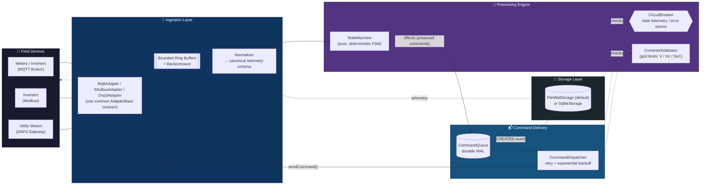
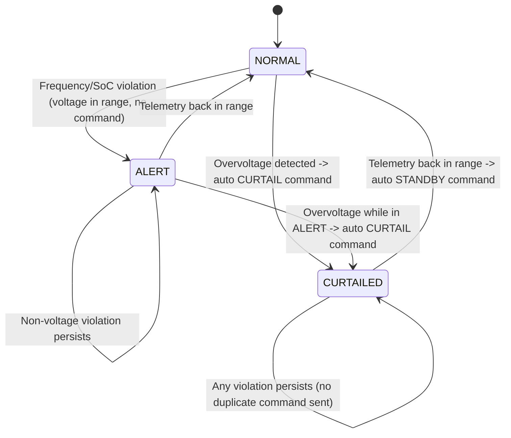
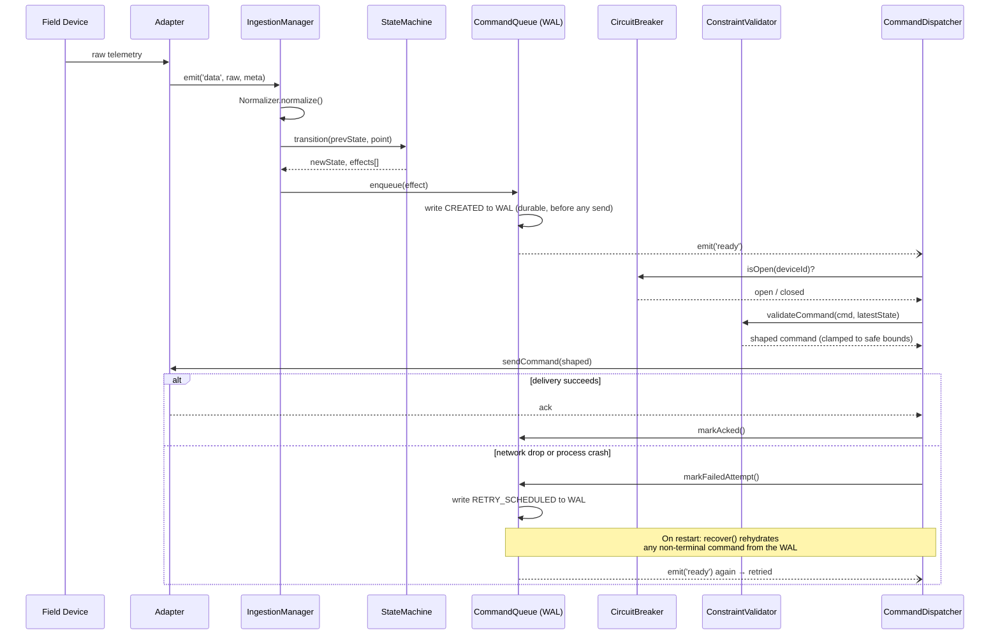

<div align="center">

# ⚡ GridSync-OS

### Distributed Energy Resource (DER) Orchestration Middleware

[](https://git.io/typing-svg)

<sub>The animated line above is rendered by an external SVG service (readme-typing-svg) — see the note at the bottom of this README if you want a zero-external-call version.</sub>

<br/>


*Normalizes fragmented DER telemetry, validates it against a deterministic grid-safety state machine, and delivers commands through a crash-safe write-ahead queue — built to run anywhere from a Termux phone to a production Linux box.*

</div>

> **License note:** `package.json` currently declares `"license": "UNLICENSED"` (all rights reserved — the default for private/proprietary Node projects). The badge above reflects that. If you decide to open-source this later, update `license` in `package.json` to `"MIT"` (or your chosen license), add a `LICENSE` file, and swap the badge to ``.

---

## Table of Contents

- [Why It's Built This Way](#why-its-built-this-way)
- [Architecture at a Glance](#architecture-at-a-glance)
- [Device State Machine](#device-state-machine)
- [Command Lifecycle & Crash Recovery](#command-lifecycle--crash-recovery)
- [Project Structure](#project-structure)
- [Getting Started (Termux)](#getting-started-termux)
- [Initializing Your Own Git Repository](#initializing-your-own-git-repository)
- [Configuration](#configuration)
- [Going to Production](#going-to-production)
- [Self-Test Suite](#self-test-suite)

---

## Why It's Built This Way

Three hard requirements shaped every design decision here:

| Requirement | Solution | Where |
|---|---|---|
| **Protocol fragmentation** — Modbus, MQTT, DNP3 all speak differently | One `AdapterBase` interface + a `Normalizer` that converts every protocol's raw payload into a single canonical schema before anything downstream sees it | `src/adapters/`, `src/ingestion/Normalizer.js` |
| **High-velocity telemetry without crashing the event loop** | Bounded, O(1) ring buffers per adapter; a batch-drain loop yields via `setImmediate()` between batches so no burst can starve timers or command dispatch | `src/ingestion/IngestionManager.js` |
| **Command signals must never be lost during network drops** | Every command is written to a durable write-ahead log (WAL) *before* any network send is attempted. A crash or dropped connection mid-dispatch just means redelivery (idempotent via `commandId`) on retry or restart | `src/commands/CommandQueue.js` |

---

## Architecture at a Glance



---

## Device State Machine

`StateMachine.transition()` is a **pure function**: `(prevState, telemetryPoint) → (newState, effects[])`, with no I/O inside it. This is the actual, verified transition graph (matches `src/engine/StateMachine.js` exactly — not an idealized version):



Because it's pure and side-effect-free, this exact graph is what the self-test suite exercises directly with fixed inputs — no mocking a transport required.

---

## Command Lifecycle & Crash Recovery

The sequence below is the "never lose a command" guarantee end-to-end, including what happens on a simulated network drop:



---

## Project Structure

<details>
<summary><b>Click to expand full file tree</b></summary>

```
gridsync-os/
├── package.json
├── README.md
├── .gitignore
├── data/                      # runtime WAL / telemetry files (gitignored)
├── scripts/
│   └── setup-termux.sh        # one-shot Termux environment bootstrap
├── src/
│   ├── index.js                       # entrypoint: wiring + process-level safety nets
│   ├── config.js                      # all tunables (grid limits, buffer sizes, timeouts)
│   ├── utils/
│   │   ├── errors.js                  # typed domain errors
│   │   ├── logger.js                  # dependency-free structured logger
│   │   ├── validation.js              # defensive input-assertion helpers
│   │   └── RingBuffer.js              # fixed-capacity O(1) circular buffer
│   ├── adapters/
│   │   ├── AdapterBase.js             # common adapter contract (EventEmitter-based)
│   │   ├── MqttAdapter.js             # real MQTT broker transport (mqtt.js, pure JS)
│   │   ├── ModbusAdapter.js           # simulated by default -- see docblock for going live
│   │   └── Dnp3Adapter.js             # simulated by default -- see docblock for going live
│   ├── ingestion/
│   │   ├── Normalizer.js              # protocol-specific payload -> canonical schema
│   │   └── IngestionManager.js        # bounded buffers + backpressure + yielding drain loop
│   ├── engine/
│   │   ├── StateMachine.js            # pure (state, telemetry) -> (newState, commands) FSM
│   │   ├── ConstraintValidator.js     # grid-limit checks + command clamping/authorization
│   │   └── CircuitBreaker.js          # blocks commands on stale telemetry / error storms
│   ├── commands/
│   │   ├── CommandQueue.js            # durable WAL-backed command queue
│   │   └── CommandDispatcher.js       # retry logic, breaker/constraint re-checks per attempt
│   ├── storage/
│   │   ├── StorageAdapter.js          # storage interface
│   │   ├── FileWalStorage.js          # default backend: dependency-free JSONL WAL
│   │   └── SqliteStorage.js           # optional backend: node:sqlite (feature-detected)
│   └── orchestrator/
│       └── GridSyncOrchestrator.js    # composition root -- wires everything together
└── test/
    └── selftest.js             # 33 tests: unit + simulated end-to-end scenarios
```

</details>

---

## Getting Started (Termux)

```bash
pkg update && pkg install nodejs git -y
git clone <your-repo-url> gridsync-os   # or unzip the delivered archive
cd gridsync-os
npm install          # pure-JS deps only, no compilation step
npm test             # run the full self-test suite (33 tests)
npm start             # boot the orchestrator (MQTT + simulated Modbus/DNP3)
```

If you don't have an MQTT broker reachable, that's fine — the MQTT adapter logs a connection failure, throttles repeated-failure logging (full detail once, then a concise summary every 10th attempt), and keeps retrying in the background without affecting the two simulated adapters (Modbus/DNP3), which run immediately. One failed subsystem never blocks the rest.

> **Running unattended on a phone?** Android's Doze/App Standby will suspend a backgrounded Termux session (you'll see all timers — heartbeat, polling, WAL compaction — freeze together, then resume). Run `pkg install termux-api && termux-wake-lock` before starting the process to prevent this, and check your OEM's battery-optimization settings (MIUI/Huawei/Samsung/OnePlus) if it still happens.

---

## Initializing Your Own Git Repository

```bash
cd gridsync-os
git init
git add -A
git commit -m "GridSync-OS: initial DER orchestration middleware core"
```

`node_modules/` and runtime data files (`data/*.jsonl`, `data/*.db`) are already excluded via `.gitignore`.

---

## Configuration

Everything tunable lives in `src/config.js` and is overridable via environment variables:

<details>
<summary><b>Click to expand full configuration reference</b></summary>

| Env var | Default | Purpose |
|---|---|---|
| `GS_MAX_BUFFER` | 10000 | Max points buffered per adapter before backpressure |
| `GS_BATCH_SIZE` | 200 | Points drained per event-loop tick |
| `GS_STALE_MS` | 15000 | Telemetry age (ms) beyond which the circuit breaker opens for a device |
| `GS_MAX_ERR_WINDOW` | 50 | Ingestion errors within `GS_ERR_WINDOW_MS` before the global breaker trips |
| `GS_CMD_MAX_ATTEMPTS` | 5 | Max dispatch retries before a command is marked FAILED |
| `GS_CMD_RETRY_BASE_MS` / `GS_CMD_RETRY_MAX_MS` | 500 / 15000 | Exponential backoff bounds for command retries |
| `GS_STORAGE_DRIVER` | `file-wal` | `file-wal` (default, zero deps) or `sqlite` (needs `node:sqlite`) |
| `GS_DATA_DIR` | `./data` | Where WAL/telemetry files live |
| `GS_MQTT_URL` | `mqtt://localhost:1883` | Broker address |
| `GS_MQTT_MAX_RECONNECT_ATTEMPTS` | 0 (unlimited) | Give up reconnecting after N failed attempts instead of retrying forever |

Grid safety limits (voltage/frequency/SoC bounds, max curtail/charge/discharge kW) are in `src/config.js` under `gridConstraints` — these are illustrative LV-distribution defaults (230V ±10%, 50Hz ±0.5) and **must be reviewed against your actual grid code and asset ratings before any real deployment.**

</details>

---

## Going to Production

- **Modbus / DNP3**: both adapters ship in simulated mode. `ModbusAdapter` documents the path to real TCP polling (e.g. via `jsmodbus`); `Dnp3Adapter` documents why DNP3 in production almost always sits behind a dedicated protocol gateway that republishes over MQTT, which `MqttAdapter` already handles. Both keep the exact same downstream contract, so nothing else changes.
- **TimescaleDB**: implement a `TimescaleStorage.js` against the same `StorageAdapter` interface as `FileWalStorage`/`SqliteStorage` (Postgres via `pg`, batched inserts). Swap it in via `GS_STORAGE_DRIVER`.
- **Grid constraints**: replace the illustrative values in `config.js` with your actual interconnection agreement / grid code limits.

---

## Self-Test Suite

```bash
npm test
```

33 tests covering:

- ✅ Pure-function correctness of the state machine (deterministic transitions, auto-curtailment on overvoltage, release on recovery)
- ✅ Constraint validation (clamping over-limit commands, rejecting unsafe discharge/charge based on SoC, fail-closed on unknown state)
- ✅ Circuit breaker behavior (stale telemetry, never-seen devices, global error-rate trip)
- ✅ **Crash recovery** — a command left mid-dispatch when storage is torn down (simulating a process crash) is correctly rehydrated and redelivered after a simulated restart
- ✅ **Network-drop resilience** — a command whose first delivery attempt fails is automatically retried and eventually delivered, with zero data loss
- ✅ Backpressure/overflow bounds (bounded memory under sustained overflow)
- ✅ Malformed-input resilience (bad payloads are discarded without disrupting subsequent valid points)
- ✅ A 5,000-point high-velocity burst processed without throwing or hanging
- ✅ MQTT reconnect-failure log throttling (1st failure logs full detail, every 10th logs a concise summary, counter resets on reconnect) and safe give-up after `GS_MQTT_MAX_RECONNECT_ATTEMPTS` (including a regression test for a double-`.end()` bug found and fixed during review)
- ✅ Full end-to-end: simulated overvoltage telemetry through the whole stack, confirming the resulting command stays within configured safe bounds

<div align="center">
<sub>

Built by [Syed Ali Hasan Moosavi](mailto:shalimoosavi@gmail.com) · [SAYANJALI NEXUS PRIVATE LIMITED](https://github.com/SHalimoosavi)

</sub>
</div>

---

<sub>**Note on external calls:** the badges and the animated typing header above are images fetched from shields.io and readme-typing-svg.demolab.com respectively when this README is rendered — normal for any GitHub project, but not literally zero-network. Every diagram in this document (architecture, state machine, sequence) is native GitHub-Flavored Markdown Mermaid, rendered entirely by GitHub itself with no external service. To make this README 100% dependency-free, delete the badge/typing-SVG block at the top and keep everything else as-is.</sub>
